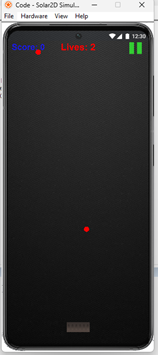
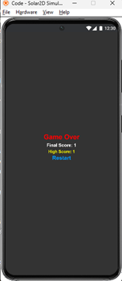
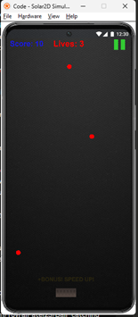

# Bucket Collect Ball Game

**Name:** Yuvraj Chiragbhai Patel  
**Student ID:** 1224030

## Overview

This project is a game of catching ball using bucket using Lua and Corona SDK/Solar 2D framework. The game features a scoring system, lives mechanism, progressive difficulty, and persistent high scoring tracking. This game offers 3 lives for the ball to be missed after that the game stops and offers to restart.

## Project Structure

The main functions and variables are in the main file and assets used are in their original form and are in the same directory.

## Features

- Physics-based gameplay with realistic ball dropping mechanics
- Touch controls to move bucket horizontally
- Scoring system with bonus speed increases every 10 points
- Lives system (3 lives) – lose a life when a is missed.
- Persistent high score saved to local storage using JSON
- Pause/Resume functionality with on-screen pause button
- Progressive difficulty – ball spawn rate increases as score increases by multiple of 10 points
- Visual feedback with bonus text animations and score shadows

## Installation Instructions

**Github Link:** https://github.com/YuvrajPatel23/Ball_catching_game

### Prerequisites

1. Corona SDK/solar 2d- download and install
2. Corona simulator

### Setup steps

1. Clone repository
   a. ` Git clone https://github.com/YuvrajPatel23/Ball_catching_game`
   b. ` Cd Ball_catching_game`
2. Verify assets
   a. Main.lua
   b. Background.jpg
   c. Bucket.png
3. Create Configuration files
4. Launch Game
   a. Open Corona Simulator
   b. Select "Open Project" and choose the main.lua
   c. The game will launch automatically

## Output Screenshots

